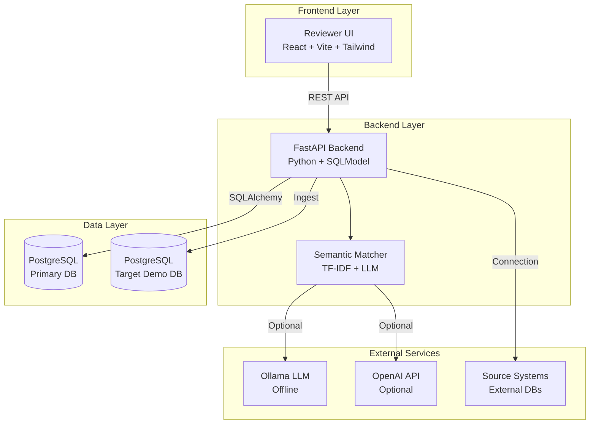
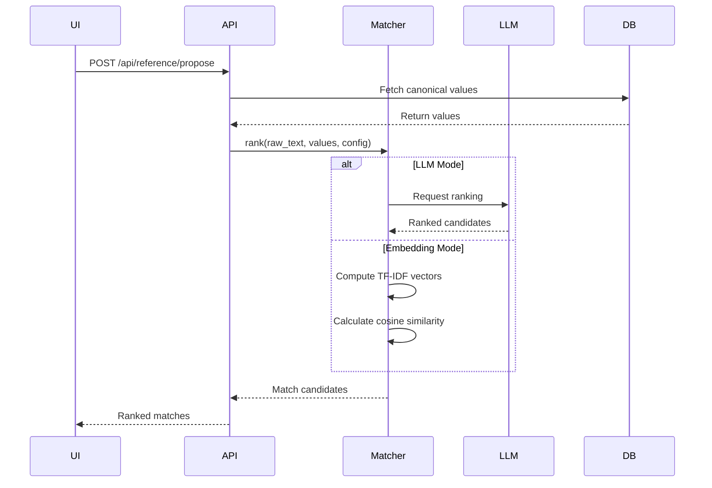
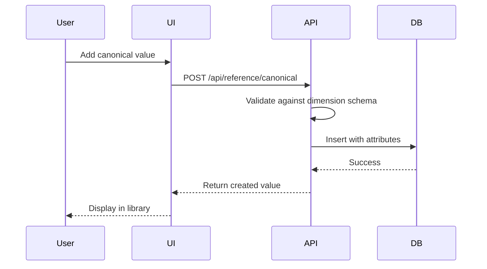
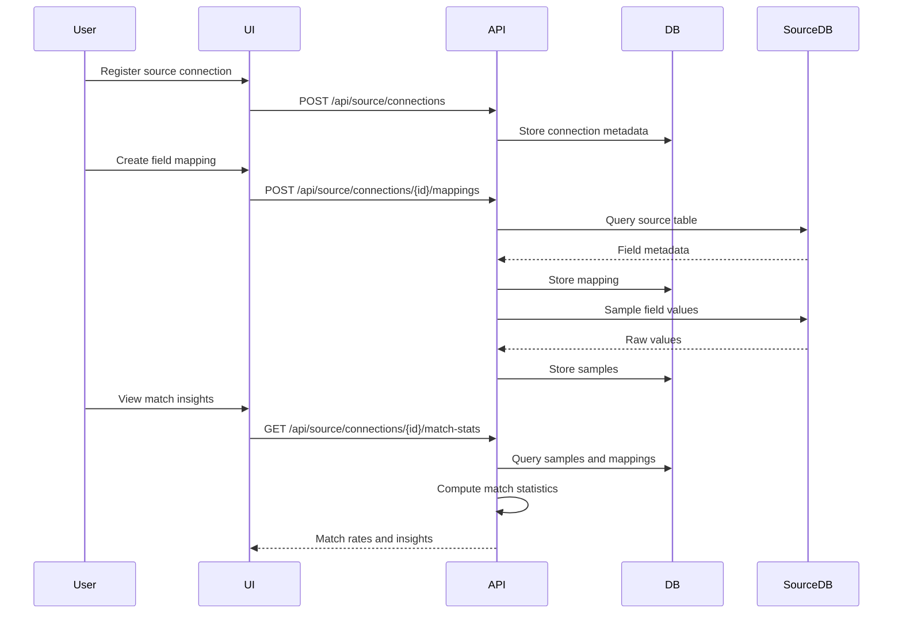
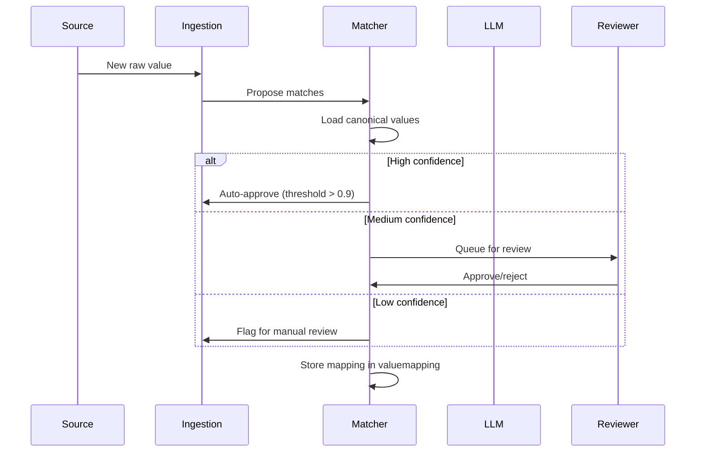

# Architecture

This document describes the system architecture, component interactions, and design decisions for RefData Hub.

## System Overview

RefData Hub is a microservices-based reference data harmonization platform consisting of four main components:



## Components

### 1. Reviewer UI (`reviewer-ui/`)

**Technology Stack:**
- React 18 with TypeScript
- Vite for build tooling
- Tailwind CSS for styling
- React Router for navigation

**Responsibilities:**
- Provide user interface for data curation
- Display match insights and analytics
- Manage canonical library and dimensions
- Configure source connections and field mappings
- Approve/reject semantic suggestions
- Support dark/light/midnight themes

**Key Pages:**
- **Dashboard** – Overview of canonical coverage and semantic playground
- **Canonical Library** – Manage curated reference values
- **Dimensions** – Maintain dimension catalog and schemas
- **Dimension Relations** – Model parent/child hierarchies
- **Source Connections** – Register and manage upstream systems
- **Field Mappings** – Align source fields to dimensions
- **Match Insights** – Visualize harmonization statistics
- **Suggestions** – Review and approve semantic matches
- **Mapping History** – Audit trail of approved mappings
- **Settings** – Configure matcher and LLM settings

### 2. FastAPI Backend (`api/`)

**Technology Stack:**
- FastAPI framework
- SQLModel for ORM
- SQLAlchemy core for database operations
- Pydantic for data validation

**Responsibilities:**
- Expose REST API endpoints
- Implement business logic for reference data
- Manage database sessions and transactions
- Coordinate semantic matching
- Handle bulk import/export operations
- Provide connection testing for source systems

**API Structure:**
```
/api
├── /reference
│   ├── /canonical          – CRUD for canonical values
│   ├── /canonical/import   – Bulk import canonical values
│   ├── /dimensions        – Manage dimension catalog
│   ├── /dimension-relations – Parent/child hierarchies
│   └── /propose          – Semantic matching suggestions
├── /source
│   ├── /connections       – Source system connections
│   ├── /connections/{id}/mappings – Field mappings
│   ├── /connections/{id}/samples – Sample data ingestion
│   ├── /connections/{id}/match-stats – Match statistics
│   ├── /connections/{id}/unmatched – Unmatched values
│   └── /value-mappings   – Approved raw-to-canonical mappings
└── /config               – System configuration
```

### 3. Semantic Matcher (`api/app/matcher.py`)

**Design Pattern:** Strategy Pattern with pluggable implementations

**Matching Strategies:**

1. **TF-IDF Embeddings** (Default)
   - Uses scikit-learn's TfidfVectorizer
   - Cosine similarity for scoring
   - Fast, no external dependencies
   - Fallback to lexical matching on failure

2. **LLM-Based Matching** (Optional)
   - **Offline Mode:** Ollama llama3 (local)
   - **Online Mode:** OpenAI-compatible API
   - Ranks candidates using semantic understanding
   - Automatic fallback to embeddings on failure

**Matching Pipeline:**


### 4. Database Layer

**Technology:** PostgreSQL 15 with SQLAlchemy

**Schema Design:**
- 10 core tables with proper indexing
- Foreign key relationships for referential integrity
- JSON columns for flexible metadata
- Timestamps for audit trails

**Key Tables:**
- `canonicalvalue` – Approved reference values
- `dimension` – Dimension catalog with schemas
- `dimensionrelation` – Parent/child hierarchies
- `sourceconnection` – Source system metadata
- `sourcefieldmapping` – Field to dimension mappings
- `valuemapping` – Approved raw-to-canonical mappings
- `sourcesample` – Sample data from sources
- `systemconfig` – Matcher and system settings

## Data Flow

### Canonical Value Management



### Source Connection & Mapping



### Semantic Matching Workflow



## Technology Decisions

### Backend: FastAPI

**Rationale:**
- Async support for high-performance API
- Automatic OpenAPI documentation
- Type safety with Pydantic validation
- Modern Python patterns

**Alternatives Considered:**
- Flask (synchronous only)
- Django (heavy for this use case)
- Node.js/Express (team expertise in Python)

### ORM: SQLModel

**Rationale:**
- Combines Pydantic and SQLAlchemy
- Automatic schema generation
- Type hints for IDE support
- Seamless validation

**Alternatives Considered:**
- Pure SQLAlchemy (more verbose)
- Django ORM (coupled to Django)
- Prisma (less Pythonic)

### Frontend: React + Vite

**Rationale:**
- Component reusability
- Rich ecosystem (React Router, testing libraries)
- Fast development with Vite HMR
- TypeScript for type safety

**Alternatives Considered:**
- Vue.js (smaller ecosystem)
- Angular (more complex)
- Svelte (less mature at project start)

### Database: PostgreSQL

**Rationale:**
- ACID compliance for data integrity
- JSON support for flexible schemas
- Excellent query performance
- Mature tooling and hosting options

**Alternatives Considered:**
- MySQL (weaker JSON support)
- MongoDB (schemaless not ideal)
- SQLite (no concurrent writes)

### Matching: Multi-Strategy

**Rationale:**
- **TF-IDF:** Fast, reliable, no external deps
- **LLM:** Semantic understanding for complex cases
- **Fallback:** Ensure system always works
- **Choice:** User can switch based on use case

## Security Considerations

### Current Implementation

- CORS configuration for API
- Database credentials in environment variables
- No authentication (development mode)

### Production Recommendations

1. **Authentication & Authorization**
   - Implement JWT-based auth
   - Role-based access control (RBAC)
   - Separate reviewer/admin/consumer roles

2. **Data Protection**
   - Encrypt database at rest
   - TLS for API communication
   - Mask sensitive fields in logs

3. **API Security**
   - Rate limiting per user
   - Request validation
   - SQL injection prevention (SQLAlchemy handles)

4. **Secrets Management**
   - Use environment-specific secrets
   - Rotate API keys regularly
   - Never commit credentials

## Scalability Considerations

### Current Architecture

- Monolithic FastAPI backend
- Single PostgreSQL instance
- In-process semantic matching

### Scaling Options

1. **Horizontal Scaling**
   - Run multiple API instances behind load balancer
   - Connection pooling in PostgreSQL
   - Stateless API design enables easy scaling

2. **Database Scaling**
   - Read replicas for analytics queries
   - Partition large tables (valuemapping)
   - Cache frequently accessed data

3. **Matching Service**
   - Extract matcher as microservice
   - Queue-based processing for bulk jobs
   - Embedding precomputation for performance

4. **Caching Strategy**
   - Redis for session management
   - Cache canonical values
   - Cache match results

## Performance Characteristics

### Typical Response Times

- API endpoints: < 100ms (p95)
- Canonical value lookup: < 50ms
- Semantic match (TF-IDF): < 200ms
- Semantic match (LLM): 1-3s
- Bulk import (1000 rows): < 5s

### Optimization Strategies

1. **Database Indexes**
   - Foreign keys on join columns
   - Composite indexes for frequent queries
   - Full-text search on text fields

2. **API Optimization**
   - Pagination for large datasets
   - Eager loading to prevent N+1 queries
   - Compression for large responses

3. **Matching Optimization**
   - Limit candidates with dimension filtering
   - Cache embedding vectors
   - Batch processing for bulk operations

## Deployment Architecture

### Development (Docker Compose)

```
┌─────────────────────────────────────┐
│         Docker Compose            │
│  ┌──────────┐  ┌────────────┐ │
│  │ reviewer  │  │   API      │ │
│  │   UI     │  │            │ │
│  └────┬─────┘  └──────┬─────┘ │
│       │               │          │
│       │               │          │
│  ┌────▼─────┐  ┌────▼─────┐ │
│  │  Nginx    │  │  DB      │ │
│  │  (80)     │  │(5432)   │ │
│  └──────────┘  └──────────┘ │
└─────────────────────────────────────┘
```

### Production (Kubernetes - Recommended)

```
┌─────────────────────────────────────────────┐
│            Kubernetes Cluster             │
│  ┌─────────┐  ┌─────────┐  ┌──────┐ │
│  │Ingress  │  │  API    │  │ DB   │ │
│  │Controller│  │ Pods    │  │Primary│ │
│  │         │  │ (x3)    │  │      │ │
│  └────┬────┘  └────┬────┘  └──┬───┘ │
│       │            │            │      │
│  ┌────▼────────────▼────────────▼─────┐ │
│  │        Service Mesh (Optional)       │ │
│  └─────────────────────────────────────┘ │
└─────────────────────────────────────────────┘
```

## Monitoring & Observability

### Logging Strategy

- **Backend:** Structured JSON logging
- **Frontend:** Console logging (dev) + service (prod)
- **Database:** Query logging for slow queries
- **Matcher:** Track match confidence distribution

### Metrics to Track

- API response times (p50, p95, p99)
- Match accuracy (user approval rate)
- Canonical library growth rate
- Source connection health
- Database connection pool usage

### Health Checks

- **API:** `/health` endpoint
- **Database:** Connection health
- **LLM Service:** Reachability test
- **Source Systems:** Connection validity

## Future Architecture Enhancements

### Planned Features

1. **Event-Driven Architecture**
   - Kafka for change events
   - Webhook notifications
   - Real-time sync to downstream systems

2. **Advanced Matching**
   - Custom model training
   - Multi-language support
   - Domain-specific embeddings

3. **Governance**
   - Approval workflows
   - Version control for mappings
   - Audit trails with immutable logs

4. **Performance**
   - Graph database for relationships
   - Vector database for embeddings
   - Precomputed match clusters
