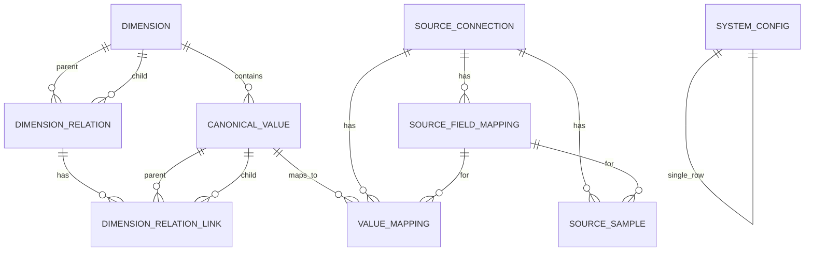

# Database Schema

This document describes the complete database schema for RefData Hub, including all tables, relationships, indexes, and constraints.

## Entity Relationship Diagram



## Tables

### 1. systemconfig

**Purpose:** Stores system-wide configuration for matcher and application settings.

**Constraints:**
- Single row table (id always = 1)

| Column | Type | Nullable | Default | Description |
|--------|------|----------|----------|-------------|
| id | INTEGER | NO | 1 (primary key) | Unique identifier (always 1) |
| default_dimension | VARCHAR | NO | 'general' | Default dimension for semantic matching |
| match_threshold | FLOAT | NO | 0.6 | Minimum confidence score for auto-approval (0.0 - 1.0) |
| matcher_backend | VARCHAR | NO | 'embedding' | Primary matching strategy ('embedding' or 'llm') |
| embedding_model | VARCHAR | NO | 'tfidf' | Embedding model to use |
| llm_mode | VARCHAR | NO | 'online' | LLM mode ('online' or 'offline') |
| llm_model | VARCHAR | YES | NULL | LLM model name (e.g., 'gpt-3.5-turbo', 'llama3') |
| llm_api_base | VARCHAR | YES | NULL | API base URL for LLM service |
| llm_api_key | VARCHAR | YES | NULL | API key for LLM service (encrypted in production) |
| top_k | INTEGER | NO | 5 | Number of match candidates to return |
| updated_at | TIMESTAMP | NO | NOW() | Last update timestamp |

**Indexes:**
- PRIMARY KEY (id)

**Example Record:**
```sql
INSERT INTO systemconfig VALUES (
  1,
  'marital_status',
  0.7,
  'llm',
  'tfidf',
  'offline',
  'llama3',
  'http://ollama:11434',
  NULL,
  10,
  NOW()
);
```

---

### 2. dimension

**Purpose:** Defines canonical dimensions (semantic domains) and their attribute schemas.

**Constraints:**
- `code` must be unique

| Column | Type | Nullable | Default | Description |
|--------|------|----------|----------|-------------|
| id | INTEGER | NO | AUTO | Unique identifier |
| code | VARCHAR | NO | UNIQUE | Dimension code (e.g., 'marital_status', 'education_level') |
| label | VARCHAR | NO | - | Human-readable dimension name |
| description | VARCHAR | YES | NULL | Optional description of the dimension |
| extra_schema | JSON | NO | '[]' | JSON schema defining additional attributes for canonical values |
| created_at | TIMESTAMP | NO | NOW() | Creation timestamp |
| updated_at | TIMESTAMP | NO | NOW() | Last update timestamp |

**Indexes:**
- PRIMARY KEY (id)
- UNIQUE (code)

**Example `extra_schema`:**
```json
[
  {
    "key": "iso_code",
    "label": "ISO 3166-1 Code",
    "type": "text",
    "required": false
  },
  {
    "key": "population",
    "label": "Population",
    "type": "numeric",
    "required": false
  }
]
```

**Example Record:**
```sql
INSERT INTO dimension (code, label, description, extra_schema) VALUES (
  'marital_status',
  'Marital Status',
  'Standardized marital status classifications',
  '[]'::jsonb
);
```

---

### 3. canonicalvalue

**Purpose:** Stores approved canonical reference values for each dimension.

**Constraints:**
- `dimension` references `dimension.code`

| Column | Type | Nullable | Default | Description |
|--------|------|----------|----------|-------------|
| id | INTEGER | NO | AUTO | Unique identifier |
| dimension | VARCHAR | NO | INDEXED | Dimension code (references dimension.code) |
| canonical_label | VARCHAR | NO | - | Approved canonical label |
| description | VARCHAR | YES | NULL | Additional notes or translations |
| attributes | JSON | NO | '{}' | Dimension-specific attributes (per dimension's extra_schema) |
| created_at | TIMESTAMP | NO | NOW() | Creation timestamp |

**Indexes:**
- PRIMARY KEY (id)
- INDEX (dimension)

**Example `attributes`:**
```json
{
  "iso_code": "US",
  "population": 331000000,
  "region": "North America"
}
```

**Example Record:**
```sql
INSERT INTO canonicalvalue (dimension, canonical_label, description, attributes) VALUES (
  'marital_status',
  'Single',
  'Never married',
  '{
    "short_code": "S",
    "sequence": 1
  }'::jsonb
);
```

---

### 4. dimensionrelation

**Purpose:** Models parent/child hierarchical relationships between dimensions.

**Constraints:**
- `parent_dimension_code` references `dimension.code`
- `child_dimension_code` references `dimension.code`
- Unique combination of (parent_dimension_code, child_dimension_code, label)

| Column | Type | Nullable | Default | Description |
|--------|------|----------|----------|-------------|
| id | INTEGER | NO | AUTO | Unique identifier |
| label | VARCHAR | NO | - | Display name for the relation |
| parent_dimension_code | VARCHAR | NO | INDEXED | Parent dimension code |
| child_dimension_code | VARCHAR | NO | INDEXED | Child dimension code |
| description | VARCHAR | YES | NULL | Optional description |
| created_at | TIMESTAMP | NO | NOW() | Creation timestamp |
| updated_at | TIMESTAMP | NO | NOW() | Last update timestamp |

**Indexes:**
- PRIMARY KEY (id)
- INDEX (parent_dimension_code)
- INDEX (child_dimension_code)
- UNIQUE (parent_dimension_code, child_dimension_code, label)

**Example Record:**
```sql
INSERT INTO dimensionrelation (label, parent_dimension_code, child_dimension_code, description) VALUES (
  'Region → District',
  'region',
  'district',
  'Hierarchical relationship from region to district'
);
```

---

### 5. dimensionrelationlink

**Purpose:** Associates canonical values across a dimension relation.

**Constraints:**
- `relation_id` references `dimensionrelation.id`
- `parent_canonical_id` references `canonicalvalue.id`
- `child_canonical_id` references `canonicalvalue.id`
- Unique combination of (relation_id, parent_canonical_id, child_canonical_id)

| Column | Type | Nullable | Default | Description |
|--------|------|----------|----------|-------------|
| id | INTEGER | NO | AUTO | Unique identifier |
| relation_id | INTEGER | NO | INDEXED | Foreign key to dimensionrelation |
| parent_canonical_id | INTEGER | NO | INDEXED | Parent canonical value ID |
| child_canonical_id | INTEGER | NO | INDEXED | Child canonical value ID |
| created_at | TIMESTAMP | NO | NOW() | Creation timestamp |
| updated_at | TIMESTAMP | NO | NOW() | Last update timestamp |

**Indexes:**
- PRIMARY KEY (id)
- INDEX (relation_id)
- INDEX (parent_canonical_id)
- INDEX (child_canonical_id)
- UNIQUE (relation_id, parent_canonical_id, child_canonical_id)

**Example Record:**
```sql
INSERT INTO dimensionrelationlink (relation_id, parent_canonical_id, child_canonical_id) VALUES (
  1,
  5,  -- Abu Dhabi (region)
  12  -- Al Ain (district)
);
```

---

### 6. sourceconnection

**Purpose:** Stores metadata for connections to external source systems.

**Constraints:**
- `name` must be unique

| Column | Type | Nullable | Default | Description |
|--------|------|----------|----------|-------------|
| id | INTEGER | NO | AUTO | Unique identifier |
| name | VARCHAR | NO | UNIQUE | Human-readable connection name |
| db_type | VARCHAR | NO | - | Database type ('postgres', 'mysql', 'snowflake', etc.) |
| host | VARCHAR | NO | - | Database hostname or IP |
| port | INTEGER | NO | 5432 | Database port |
| database | VARCHAR | NO | - | Database/schema name |
| username | VARCHAR | NO | - | Service account username |
| password | VARCHAR | YES | NULL | Password (encrypted in production) |
| options | VARCHAR | YES | NULL | JSON string with additional connection options |
| created_at | TIMESTAMP | NO | NOW() | Creation timestamp |
| updated_at | TIMESTAMP | NO | NOW() | Last update timestamp |

**Indexes:**
- PRIMARY KEY (id)
- UNIQUE (name)

**Example `options`:**
```json
{
  "sslmode": "require",
  "warehouse": "prod_wh",
  "role": "data_reader"
}
```

**Example Record:**
```sql
INSERT INTO sourceconnection (name, db_type, host, port, database, username, password) VALUES (
  'Production Data Warehouse',
  'postgres',
  'db.example.com',
  5432,
  'production',
  'readonly_user',
  'encrypted_password'
);
```

---

### 7. sourcefieldmapping

**Purpose:** Maps source table fields to canonical dimensions.

**Constraints:**
- `source_connection_id` references `sourceconnection.id`

| Column | Type | Nullable | Default | Description |
|--------|------|----------|----------|-------------|
| id | INTEGER | NO | AUTO | Unique identifier |
| source_connection_id | INTEGER | NO | INDEXED | Foreign key to sourceconnection |
| source_table | VARCHAR | NO | - | Source table or view name |
| source_field | VARCHAR | NO | - | Source column name |
| ref_dimension | VARCHAR | NO | - | Target dimension code |
| description | VARCHAR | YES | NULL | Optional description |
| created_at | TIMESTAMP | NO | NOW() | Creation timestamp |
| updated_at | TIMESTAMP | NO | NOW() | Last update timestamp |

**Indexes:**
- PRIMARY KEY (id)
- INDEX (source_connection_id)

**Example Record:**
```sql
INSERT INTO sourcefieldmapping (source_connection_id, source_table, source_field, ref_dimension) VALUES (
  1,
  'customers',
  'marital_status_raw',
  'marital_status'
);
```

---

### 8. sourcesample

**Purpose:** Stores aggregated sample values from source systems.

**Constraints:**
- `source_connection_id` references `sourceconnection.id`

| Column | Type | Nullable | Default | Description |
|--------|------|----------|----------|-------------|
| id | INTEGER | NO | AUTO | Unique identifier |
| source_connection_id | INTEGER | NO | INDEXED | Foreign key to sourceconnection |
| source_table | VARCHAR | NO | INDEXED | Source table name |
| source_field | VARCHAR | NO | INDEXED | Source field name |
| dimension | VARCHAR | YES | NULL | Optional dimension hint |
| raw_value | VARCHAR | NO | - | Observed raw value |
| occurrence_count | INTEGER | NO | 1 | Number of times this value appeared |
| last_seen_at | TIMESTAMP | NO | NOW() | Last time this value was observed |

**Indexes:**
- PRIMARY KEY (id)
- INDEX (source_connection_id)
- INDEX (source_table)
- INDEX (source_field)

**Example Record:**
```sql
INSERT INTO sourcesample (source_connection_id, source_table, source_field, raw_value, occurrence_count) VALUES (
  1,
  'customers',
  'marital_status_raw',
  'Never Married',
  150
);
```

---

### 9. valuemapping

**Purpose:** Stores approved mappings from raw source values to canonical values.

**Constraints:**
- `source_connection_id` references `sourceconnection.id`
- `canonical_id` references `canonicalvalue.id`

| Column | Type | Nullable | Default | Description |
|--------|------|----------|----------|-------------|
| id | INTEGER | NO | AUTO | Unique identifier |
| source_connection_id | INTEGER | NO | INDEXED | Foreign key to sourceconnection |
| source_table | VARCHAR | NO | INDEXED | Source table name |
| source_field | VARCHAR | NO | INDEXED | Source field name |
| raw_value | VARCHAR | NO | INDEXED | Raw value from source |
| canonical_id | INTEGER | NO | - | Foreign key to canonicalvalue |
| status | VARCHAR | NO | 'approved' | Mapping status |
| confidence | FLOAT | YES | NULL | Confidence score at approval time |
| suggested_label | VARCHAR | YES | NULL | Suggested canonical label |
| notes | VARCHAR | YES | NULL | Reviewer notes |
| created_at | TIMESTAMP | NO | NOW() | Creation timestamp |
| updated_at | TIMESTAMP | NO | NOW() | Last update timestamp |

**Indexes:**
- PRIMARY KEY (id)
- INDEX (source_connection_id)
- INDEX (source_table)
- INDEX (source_field)
- INDEX (raw_value)
- INDEX (canonical_id)

**Example Record:**
```sql
INSERT INTO valuemapping (source_connection_id, source_table, source_field, raw_value, canonical_id, confidence, status) VALUES (
  1,
  'customers',
  'marital_status_raw',
  'Never Married',
  5,
  0.95,
  'approved'
);
```

---

### 10. rawvalue

**Purpose:** Stores raw values pending review (legacy table, used for pending workflows).

**Constraints:**
- `proposed_canonical_id` references `canonicalvalue.id`

| Column | Type | Nullable | Default | Description |
|--------|------|----------|----------|-------------|
| id | INTEGER | NO | AUTO | Unique identifier |
| dimension | VARCHAR | NO | INDEXED | Dimension code |
| raw_text | VARCHAR | NO | - | Unstandardized text |
| status | VARCHAR | NO | 'pending' | Review status ('pending', 'approved', 'rejected') |
| proposed_canonical_id | INTEGER | YES | NULL | Suggested canonical match |
| notes | VARCHAR | YES | NULL | Reviewer notes |
| created_at | TIMESTAMP | NO | NOW() | Creation timestamp |

**Indexes:**
- PRIMARY KEY (id)
- INDEX (dimension)
- INDEX (status)
- INDEX (proposed_canonical_id)

---

## Common Queries

### Get Canonical Values by Dimension

```sql
SELECT id, canonical_label, description, attributes
FROM canonicalvalue
WHERE dimension = 'marital_status'
ORDER BY canonical_label;
```

### Get Unmapped Sample Values

```sql
SELECT s.raw_value, s.occurrence_count
FROM sourcesample s
LEFT JOIN valuemapping v ON (
  s.source_connection_id = v.source_connection_id
  AND s.source_table = v.source_table
  AND s.source_field = v.source_field
  AND s.raw_value = v.raw_value
)
WHERE s.source_connection_id = 1
  AND v.id IS NULL
ORDER BY s.occurrence_count DESC;
```

### Calculate Match Rate

```sql
SELECT
  fm.ref_dimension,
  COUNT(DISTINCT v.id) AS mapped_count,
  COUNT(DISTINCT s.raw_value) AS total_count,
  ROUND(
    COUNT(DISTINCT v.id)::numeric / COUNT(DISTINCT s.raw_value) * 100,
    2
  ) AS match_rate
FROM sourcefieldmapping fm
LEFT JOIN valuemapping v ON (
  fm.source_connection_id = v.source_connection_id
  AND fm.source_table = v.source_table
  AND fm.source_field = v.source_field
)
LEFT JOIN sourcesample s ON (
  fm.source_connection_id = s.source_connection_id
  AND fm.source_table = s.source_table
  AND fm.source_field = s.source_field
)
WHERE fm.source_connection_id = 1
GROUP BY fm.ref_dimension;
```

### Get Dimension Hierarchy

```sql
SELECT
  dr.label AS relation_label,
  p.code AS parent_code,
  p.label AS parent_label,
  c.code AS child_code,
  c.label AS child_label
FROM dimensionrelation dr
JOIN dimension p ON dr.parent_dimension_code = p.code
JOIN dimension c ON dr.child_dimension_code = c.code
ORDER BY p.label, c.label;
```

---

## Data Integrity

### Cascade Rules

- **Dimension Relations:** No cascade (manual cleanup required)
- **Dimension Links:** No cascade (manual cleanup required)
- **Value Mappings:** No cascade on canonical value deletion
- **Source Samples:** No cascade on connection deletion (manual cleanup)

### Constraints

1. **Unique Constraints:**
   - `dimension.code` must be unique
   - `sourceconnection.name` must be unique
   - `dimensionrelation` has unique (parent, child, label) combination
   - `dimensionrelationlink` has unique (relation, parent, child) combination

2. **Foreign Key Constraints:**
   - All foreign keys must reference existing records
   - ON DELETE behavior: RESTRICT (manual cleanup required)

---

## Performance Considerations

### Indexing Strategy

1. **High-Query Columns:**
   - `canonicalvalue.dimension` – Indexed for filtering by dimension
   - `valuemapping.source_connection_id` – Indexed for connection queries
   - `valuemapping.raw_value` – Indexed for mapping lookups
   - `sourcesample.source_connection_id`, `source_table`, `source_field` – Composite index

2. **Query Patterns:**
   - Use dimension filtering before joining canonical values
   - Limit results with pagination for large datasets
   - Use EXISTS instead of IN for subqueries

### Table Sizes (Estimates)

| Table | Typical Rows | Row Size | Estimated Size (10K rows) |
|-------|--------------|-----------|---------------------------|
| systemconfig | 1 | 500 B | 500 B |
| dimension | 20-50 | 1 KB | 20-50 KB |
| canonicalvalue | 1,000-10,000 | 500 B | 500 KB - 5 MB |
| sourceconnection | 5-50 | 1 KB | 5-50 KB |
| sourcefieldmapping | 50-500 | 500 B | 25-250 KB |
| sourcesample | 10,000-100,000 | 300 B | 3-30 MB |
| valuemapping | 10,000-1,000,000 | 400 B | 4-400 MB |

---

## Migration Guide

### Adding a New Column

```sql
-- Add column with default value
ALTER TABLE canonicalvalue ADD COLUMN active BOOLEAN DEFAULT TRUE;

-- Create index if frequently queried
CREATE INDEX idx_canonicalvalue_active ON canonicalvalue(active);
```

### Changing Column Type

```sql
-- Rename existing column
ALTER TABLE canonicalvalue RENAME COLUMN canonical_label TO canonical_label_old;

-- Add new column with correct type
ALTER TABLE canonicalvalue ADD COLUMN canonical_label TEXT;

-- Migrate data
UPDATE canonicalvalue SET canonical_label = canonical_label_old;

-- Drop old column
ALTER TABLE canonicalvalue DROP COLUMN canonical_label_old;
```

### Creating Indexes

```sql
-- Single column index
CREATE INDEX idx_canonicalvalue_dimension ON canonicalvalue(dimension);

-- Composite index
CREATE INDEX idx_valuemapping_lookup ON valuemapping(
  source_connection_id,
  source_table,
  source_field,
  raw_value
);

-- Partial index
CREATE INDEX idx_valuemapping_active ON valuemapping(canonical_id)
WHERE status = 'approved';
```

---

## Backup and Restore

### Backup

```bash
# Full database backup
pg_dump -h localhost -U refdata -d refdata > backup.sql

# Schema only
pg_dump -h localhost -U refdata -d refdata --schema-only > schema.sql

# Data only
pg_dump -h localhost -U refdata -d refdata --data-only > data.sql
```

### Restore

```bash
# Restore from backup
psql -h localhost -U refdata -d refdata < backup.sql
```

---

## Security Notes

### Sensitive Data

1. **Passwords:** Store encrypted in production, plain text in dev
2. **API Keys:** Store in `systemconfig.llm_api_key` (encrypt in production)
3. **Connection Strings:** Never commit to version control

### Row-Level Security (Future)

Consider implementing RLS for multi-tenant scenarios:

```sql
-- Example: Restrict users to their own connections
CREATE POLICY user_connections_policy ON sourceconnection
  FOR ALL
  USING (owner_id = current_user_id());
```
