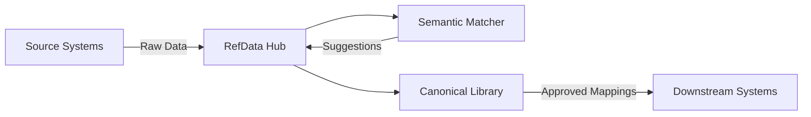

# RefData Hub

A semi-automated reference data and standardization service for global projects. The platform harmonizes common reference dimensions (marital status, education, nationality, employment status, and more) by semantically matching new raw values, routing them to reviewers for approval, and maintaining a central mapping repository.

## What is RefData Hub?

RefData Hub solves the problem of inconsistent reference data across multiple systems. It provides:

- **Centralized Reference Library** – Single source of truth for canonical values
- **Semantic Matching** – AI-powered suggestions for standardizing raw data
- **Reviewer Workflow** – Curate, approve, and manage mappings through a modern UI
- **Source Integration** – Connect to upstream systems and profile data in real time
- **Analytics & Insights** – Track harmonization health and match rates

## Key Features

- **Semantic Matching** – Use NLP and embedding models to suggest standardized values
- **Reviewer UI** – Modern, theme-switchable interface with dark/light/midnight modes
- **Source Connections** – Connect to upstream systems, test connections, inspect schemas
- **Field Mappings** – Align source tables/fields to reference dimensions
- **Match Insights** – Visualize match rates, track harmonization health
- **Dimension Relations** – Model parent/child hierarchies (e.g., regions → districts)
- **Bulk Operations** – Import/export canonical values and mappings via CSV/Excel

## Quick Start

Get RefData Hub running in under 5 minutes with Docker:

```bash
docker compose up --build
```

Access the application:
- **Reviewer UI:** http://localhost:5173
- **API Documentation:** http://localhost:8000/docs

<figure>
  
  <figcaption>Main dashboard with coverage metrics and semantic matching playground</figcaption>
</figure>

<figure>
  
  <figcaption>Test semantic matching with real-time confidence scores</figcaption>
</figure>

This command starts:
- **PostgreSQL** database with example canonical values
- **FastAPI backend** with REST API endpoints
- **Reviewer UI** React dashboard
- **Ollama LLM** runtime for offline semantic matching

For detailed setup instructions, see the [Quickstart Guide](quickstart.md).

## Documentation

### Getting Started
- **[Quickstart Guide](quickstart.md)** – Get up and running with Docker
- **[Deployment Guide](deployment.md)** – Production deployment strategies

### Understanding the System
- **[Architecture](architecture.md)** – System design and component interactions
- **[Database Schema](database-schema.md)** – Complete data model documentation
- **[Features Overview](features.md)** – Detailed feature capabilities

### Developer Resources
- **[Developer Guide](development.md)** – Local development setup and workflow
- **[API Reference](api.md)** – REST endpoints and integration examples
- **[Testing Guide](testing.md)** – Test strategies and execution
- **[Configuration Reference](configuration.md)** – System settings and environment variables

### User Guides
- **[Canonical Library Guide](canonical-library.md)** – Managing curated reference values
- **[Troubleshooting](troubleshooting.md)** – Common issues and solutions

### Community
- **[Contributing](../CONTRIBUTING.md)** – Guidelines for contributing
- **[Changelog](../CHANGELOG.md)** – Version history and changes

## Tech Stack

- **Backend:** FastAPI (Python) with SQLModel/PostgreSQL
- **Frontend:** React 18 + Vite + Tailwind CSS
- **Matching:** TF-IDF embeddings + OpenAI/Ollama LLM support
- **Testing:** Pytest (backend) + Vitest (frontend)
- **Infrastructure:** Docker Compose / Kubernetes

## Architecture Overview



RefData Hub sits between source systems and downstream consumers, providing intelligent harmonization of reference data through semantic matching and human curation.

## Use Cases

- **Data Warehousing** – Harmonize reference data from multiple source systems
- **Data Quality** – Detect and fix inconsistent reference values
- **Analytics** – Ensure consistent dimensions across reporting systems
- **Data Migration** – Map legacy reference values to new standards
- **Compliance** – Maintain auditable reference data mappings

## Support

- 📖 [Documentation](https://rezer-bleede.github.io/refdata-hub/)
- 🐛 [Issue Tracker](https://github.com/rezer-bleede/refdata-hub/issues)
- 💬 [Discussions](https://github.com/rezer-bleede/refdata-hub/discussions)

## License

This project is released under the [MIT License](../LICENSE).
